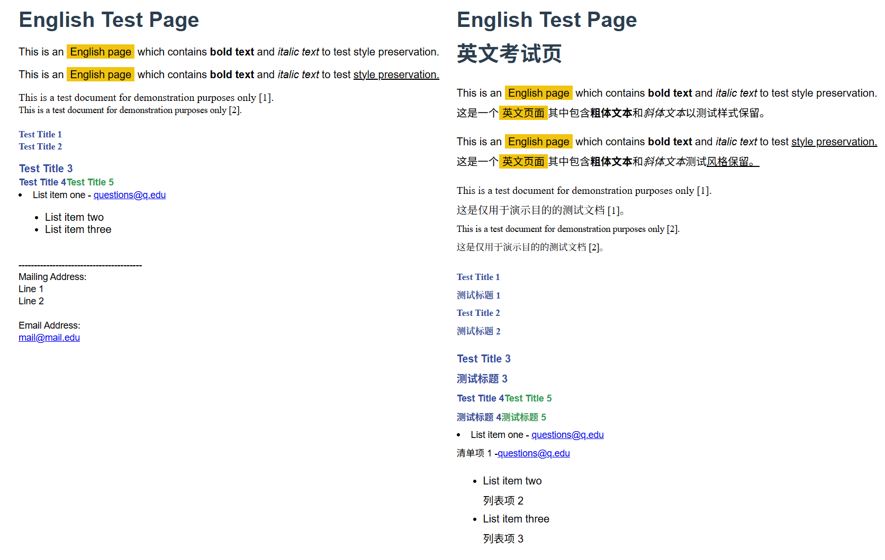

# hfit

`hfit` (Html File Immersive Translater) 是一个用于翻译本地 HTML 文件的模块，它支持多种在线和离线翻译服务，并提供两种翻译模式以满足不同需求：

* **简单模式 (Simple Mode):** 仅翻译纯文本内容，不保留元素内部的标签结构（例如 `<strong>`, `<em>` 等）。
* **高级模式 (Advanced Mode):** 尝试保留"语义块"内的 HTML 标签结构，在翻译的同时保留加粗、斜体、链接等格式。

模块最初目的是出于兴趣模仿项目 [immersive-translate](https://github.com/immersive-translate/old-immersive-translate) (沉浸式翻译) 写的一个本地工具，也是一个接触AI辅助编程过程中的练手项目，大部分项目代码由AI完成。

<div align=center></div>

*p.s. 目前这个时间点的实际感受来说，Cursor这类工具在写比较复杂的项目时对使用者的能力要求还是比较高的。最好能够把思路和模块都划清楚再指导模型来做，直接提需求或者从结果表现上要求修改的话，容易瞎猜乱写。*

  

## 1. 功能实现思路与模块划分

项目的核心处理流程围绕着 HTML 解析、内容提取、翻译和结果重组。主要分为以下几个模块：

1. **核心逻辑模块 (`hfit/core.py`)**:

   * 包含核心的翻译函数 `run_translation`，这是模块对外提供的主要编程接口 (API)。
   * `run_translation` 函数负责:
     * 接收翻译所需参数（输入/输出文件、语言、服务、模式、调试选项等）。
     * 打印执行信息。
     * 调用 `hfit.translation_services.get_translation_service` 工厂函数创建指定的翻译服务实例。
     * 创建 `hfit.html_processor.HTMLProcessor` 实例，并将翻译服务实例注入。
     * 调用 `HTMLProcessor` 的 `translate_file` 方法启动整个翻译流程。
     * 处理异常并返回最终输出文件路径。
   * 此模块不直接处理命令行参数解析。
2. **CLI入口模块 (`hfit/cli.py`)**:

   * 作为命令行入口，通过 `pyproject.toml` 中的 `[project.scripts]` 配置成 `hfit` 命令。
   * 包含 `main` 函数，负责:
     * 使用 `argparse` 解析命令行参数。
     * 调用 `add_translation_options` 函数来定义参数。
     * 对解析后的参数进行基本校验（如输入文件是否存在）。
     * 调用 `hfit.core.run_translation` 函数，将解析后的参数传递给核心逻辑。
     * 根据 `run_translation` 的执行结果（是否抛出异常）返回退出码。
   * 包含 `add_translation_options` 函数，用于向 `argparse.ArgumentParser` 添加具体的命令行选项（如 `-i`, `-o`, `--service` 等），它会从 `hfit.config` 导入 `TRANSLATION_SERVICE_OPTIONS`。
3. **配置模块 (`hfit/config.py`)**:

   * **只包含配置数据和简单辅助函数，不包含核心业务逻辑或CLI逻辑**。
   * 定义常量，如不需翻译的 HTML 标签 (`HTML_TAGS_NO_TRANSLATE`)、内联文本标签 (`HTML_TAGS_INLINE_TEXT`)、忽略的内联标签 (`HTML_TAGS_INLINE_IGNORE`) 等。
   * 定义支持的翻译服务列表常量 `TRANSLATION_SERVICE_OPTIONS`，供 `cli.py` 使用。
   * 定义默认注入的 CSS 样式字符串 (`DEFAULT_CSS`, `DYNAMIC_CSS`, `USER_CUSTOM_CSS`)，供 `html_processor.py` 使用。
   * 提供生成唯一会话 ID 的函数 `generate_session_id`。
4. **翻译服务模块 (`hfit/translation_services.py`)**:

   * **基类 `TranslationService`**: 定义所有翻译服务的统一接口，包含 `translate_batch(texts)` 和 `translate_text(text)` 方法，以及调试输出 (`debug_print`)、进度格式化 (`format_progress`)、HTML 转义/反转义等辅助功能。
   * **具体服务实现**:
     * `GoogleTranslationService`: 使用 `requests` 访问 Google Translate 的免费 API (`translate.googleapis.com`)。
     * `BingTranslationService`: 尝试通过访问 `bing.com/translator` 获取必要的动态参数（如 `key`, `token`, `IG`, `IID`），然后使用这些参数调用 Bing 的翻译 API (`bing.com/ttranslatev3`)。
     * `YandexTranslationService`: 访问 `translate.yandex.net/website-widget` 获取 SID，然后调用 `translate.yandex.net/api/v1/tr.json/translate` 进行翻译。将批量文本用 `<wbr>` 连接后一次性发送。
     * `ArgosTranslationService`: 使用本地 `argostranslate` 库。在初始化时会检查所需的语言模型包是否已安装 (`_ensure_translation_package`)，如果未安装会尝试自动下载并安装。
   * **工厂函数 `get_translation_service`**: 根据传入的服务名称字符串，返回相应的翻译服务实例。
5. **HTML 处理模块 (`hfit/html_processor.py`)**:

   * **核心类 `HTMLProcessor`**: 负责 HTML 的解析、处理和翻译结果插入。
   * **`__init__`**: 初始化时接收翻译服务实例、处理模式 (`preserve_tags_structure`，由 `-mode` 参数转换而来) 和调试标志。
   * **`translate_file`**: 控制文件读写和调用核心翻译逻辑的入口。
   * **`translate_html_content`**: 核心处理函数，执行以下步骤：
     1. **解析**: 使用 `BeautifulSoup` 解析 HTML 字符串。
     2. **样式与标记**: 添加必要的 CSS 样式 (`_add_styles`) 到 `<head>`，给 `<html>` 添加 `hift-state="dual"` 属性，给 `<body>` 添加唯一的 `data-hfit-walked` 会话 ID。
     3. **段落识别 (`_find_paragraphs`)**:  这是识别哪些内容需要被翻译的第一步。
        * 采用递归方式遍历文档 DOM 树。
        * **规则 1**: 遇到非内联元素（块级元素，如 `<div>`, `<p>`, `<h1>`, `<li>` 等，具体由 `HTML_TAGS_INLINE_TEXT` 和 `HTML_TAGS_INLINE_IGNORE` 排除法定义）时，将该元素标记为一个新段落 (`data-hfit-paragraph="1"`)。
        * **规则 2**: 遇到 `<br>` 标签时，将其后的第一个非空兄弟节点（无论内联或块级）标记为一个新段落。
        * **规则 3**: 如果 `<br>` 后面直接跟的是文本节点，会将这些连续的文本节点（直到下一个 `<br>` 或块结束）收集起来，用一个新的、标记为段落的 `<span>`（带有 `data-hfit-generated="1"`）包裹它们。
        * **规则 4**: 第一次遍历后，会进行第二次遍历 (`find_text_elements`)，查找那些包含文本但其容器尚未被标记为段落的内联元素（如 `<span>Text</span>`），将其最外层非内联祖先标记为段落。
        * 使用 `set` 避免重复标记同一个元素。
        * 返回一个包含所有被标记为段落的 `Tag` 对象的列表。
     4. **语义块提取与文本收集**:  对上一步找到的每个 `paragraph` 元素，提取其中需要翻译的"最小语义块"。
        * 调用 `_extract_semantic_blocks(paragraph)`。
        * **遍历**: 该函数递归遍历 `paragraph` 的子节点。
        * **分块**: 当遇到另一个被标记为 `data-hfit-paragraph` 的元素时，当前语义块结束；或者当遍历完 `paragraph` 时，最后一个语义块结束。
        * **文本收集**: 收集当前语义块范围内的所有非空文本节点 (`current_text_nodes`)。
        * **最小公共祖先 (`find_minimum_common_ancestor`)**: 当一个语义块结束时，计算 `current_text_nodes` 的最小公共祖先 (`common_ancestor`)。这个祖先是包含这些文本节点的最深的共同父标签。
        * **结束标记 (`_extract_semantic_blocks` -> `finish_current_block`)**: 创建一个隐藏的 `<span>` 作为结束标记 (`end_marker`)。
          * 如果块是因为遇到下一个段落 (`next_paragraph_element`) 而结束，标记插入到 `next_paragraph_element` 之前。
          * **如果块是自然结束（例如遇到 `<br>` 或父元素结尾）**，则找到 `current_text_nodes` 中最后一个文本节点 (`last_text`)，向上追溯找到作为 `common_ancestor` 直接子节点的那个祖先 (`node_to_insert_after`)，然后将 `end_marker` 插入到 `node_to_insert_after` 的后面。这确保了标记紧随当前块内容的实际结束位置。
        * **文本准备**:
          * 对每个提取出的语义块（包含 `nodes`, `common_ancestor`, `end_marker`），深度复制 (`copy.deepcopy`) 其 `common_ancestor` 得到 `ancestor_copy`。
          * **清理 (`_clean_copy_for_translation`)**:  清理 `ancestor_copy`，只保留当前语义块的 `nodes` 及其必要的父标签结构。
            * 构建一个包含 `nodes` 及它们所有祖先（直到 `ancestor_copy`）的集合 `nodes_to_keep_with_ancestors`。
            * 递归遍历 `ancestor_copy` (`_clean_copy_recursive`)，移除所有不在 `nodes_to_keep_with_ancestors` 集合中的节点（包括标签和非空文本）。这会剪除属于后续或兄弟语义块的分支。
            * 最后调用 `_clean_empty_tags` 移除可能残留的空标签。
          * 从清理后的 `ancestor_copy` 中提取纯文本节点 (`text_nodes`) 及其文本内容 (`all_texts_to_translate`)。
          * 创建 `node_map` 以便后续将翻译结果放回 `ancestor_copy` 中的正确文本节点。
        * **映射**: 将提取的文本及其处理信息（块类型、原始段落、块结构、清理后的副本、节点映射、文本ID列表、结束标记）存储在 `text_to_original_map` 字典中。
     5. **批量翻译**: 将收集到的所有 `all_texts_to_translate` 列表传递给 `translation_service.translate_batch` 进行一次性翻译，得到 `all_translated_texts`。
     6. **翻译结果插入**:  遍历 `text_to_original_map`：
        * 根据 `text_id`(s) 从 `all_translated_texts` 获取翻译结果。
        * 将翻译结果应用到对应的 `ancestor_copy` 中的文本节点（通过 `node_map`）。
        * 将修改后的 `ancestor_copy` 的内部 HTML 内容解码为字符串 `translated_html`。
        * 调用 `_create_translation_wrapper(translated_html)` 创建包含翻译内容的 `<font>` 包装器元素 `wrapper_element`（**注意：此时不插入**）。
        * 找到当前块对应的 `end_marker`。
        * 调用 `end_marker.insert_before(wrapper_element)` 将翻译包装器插入到主 `soup` 文档中、结束标记之前的位置。
        * 更新已处理段落计数器 `processed_count`。
     7. **返回**: 返回最终处理过的 `soup` 对象的字符串表示。

  

## 2. Usage

### 2.1 命令行使用

安装后，可以直接在终端中使用 `hfit` 命令，配合相关参数。如果未安装，可以使用 `python -m hfit.cli` 或 `python hfit.py`。

**基本语法:**

```bash
hfit <input_file> [options]
```

**主要参数:**

* `-i <input_file>`: 【必填】要翻译的源 HTML 文件路径。
* `-o <output_file>`: 【可选】指定输出的翻译后 HTML 文件路径。如果省略，将在输入文件同目录下生成 `_translated` 后缀的文件。
* `--from <source_language>`: 【可选】源语言代码。默认为 `en`。
* `--to <target_language>`: 【可选】目标语言代码（如 `zh-CN`, `ja`, `fr` 等）。默认为 `zh-CN`。
* `-s, --service <service_name>`: 【可选】选择翻译服务。支持 `google`, `bing`, `yandex`, `argos`。默认为 `bing`。
* `-mode <mode>`: 【可选】翻译模式。可选 `simple`（默认）或 `advanced`。
* `-debug, --verbose`: 【可选】启用所有调试信息（HTML 处理和翻译服务）。
* `-html-debug`: 【可选】仅启用 HTML 处理的调试信息。
* `-trans-debug`: 【可选】仅启用翻译服务的调试信息。

**示例:**

1. **将 `example.html` 翻译成中文（简体），使用 Google 翻译，高级模式，并保存为 `example_zh.html`：**

   ```bash
   hfit example.html -o example_zh.html -mode advanced -s google --to zh-CN
   ```
2. **将 `document.html` 从英文翻译成法文，使用本地 Argos 翻译，简单模式，并启用所有调试信息：**

   ```bash
   hfit document.html --from en --to fr -s argos -mode simple -debug
   ```

### 2.2 作为模块使用

可以直接导入 `hfit` 模块并调用其核心翻译函数 `run_translation`：

```python
from hfit import run_translation

try:
    output_path = run_translation(
        input_file='path/to/your/input.html', 
        output_file='path/to/your/output.html', 
        source_language='en',
        target_language='zh-CN',
        translation_service_name='google', # 或 'bing', 'yandex', 'argos'
        mode='advanced', # 或 'simple'
        html_debug=False,
        trans_debug=False
    )
    print(f"翻译完成，输出文件位于: {output_path}")
except FileNotFoundError as e:
    print(e)
except Exception as e:
    print(f"处理过程中发生错误: {e}")

```

**注意:** 如果使用 `argos` 服务，请确保已通过 `pip install argostranslate` 或 `pip install hfit[argos]` (如果配置了 extra) 安装了库，并且对应的语言模型包可用（程序会尝试自动下载）。
